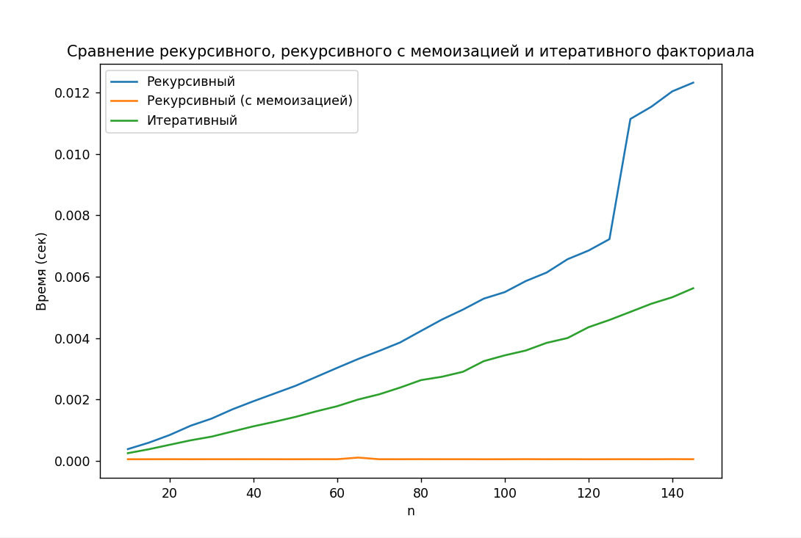

# Лабораторная работа №5
**Задача**:
Сравните время работы двух реализаций функции вычисления факториала:

- рекурсивной,

- нерекурсивной (через цикл).

Изучить материал про мемоизацию и реализовать сравнение мемоизованных и немемоизованных вариантов функций (рекурсивной и нерекурсивной. Проанализировать результаты и сделать выводы, описать выводы в отчете, построить графики
___

**Код**:
```python
import timeit
import random
import matplotlib.pyplot as plt


def fact_recursive(n):

    if n < 2:
        return 1

    return fact_recursive(n - 1) * n


def fact_iterative(n):

    result = 1

    for num in range(1, n + 1):
        result *= num

    return result


def benchmark(func, data, number, repeat):

    times = timeit.repeat(lambda: func(n), number=number, repeat=repeat)
    return min(times)


data = list(range(10, 150, 5))

res_recursive = []
res_iterative = []

for n in data:
    res_recursive.append(benchmark(fact_recursive, n, 1000, 5))
    res_iterative.append(benchmark(fact_iterative, n, 1000, 5))

plt.plot(data, res_recursive, label="Рекурсивный")
plt.plot(data, res_iterative, label="Итеративный")
plt.xlabel("n")
plt.ylabel("Время (сек)")
plt.title("Сравнение рекурсивного и итеративного факториала")
plt.legend()
plt.show()
"""
```
___
**Результат работы программы:**

___
**Вывод:**
Если посмотреть на графики зависимости времени выполнения функций от введенных данных, то можно увидеть следующее:
- Рекурсивная функция выполняется дольше при использованных данных
- рекурсивная функция растет быстрее (особенно начиная от значений n > 120)

Отсюда можно сделать вывод, что целесообразнее использовать итеративный (нерекурсивный) способ при написании функции факториала