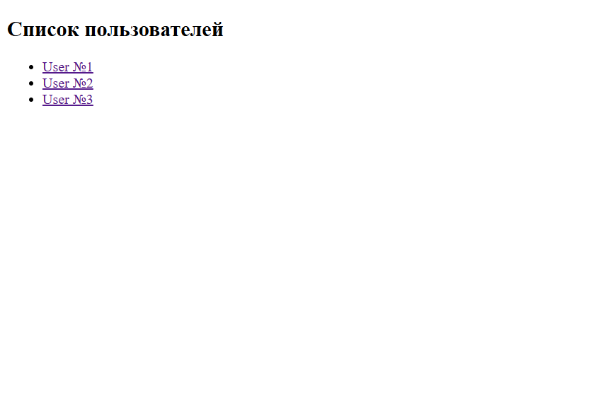
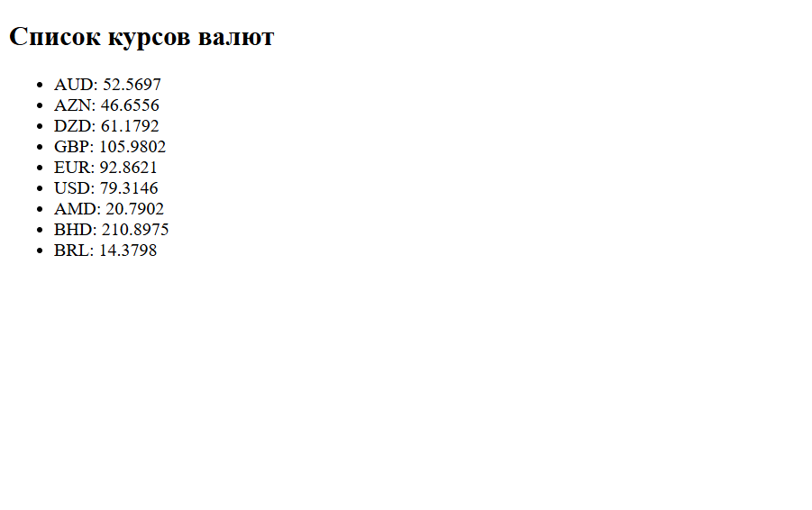
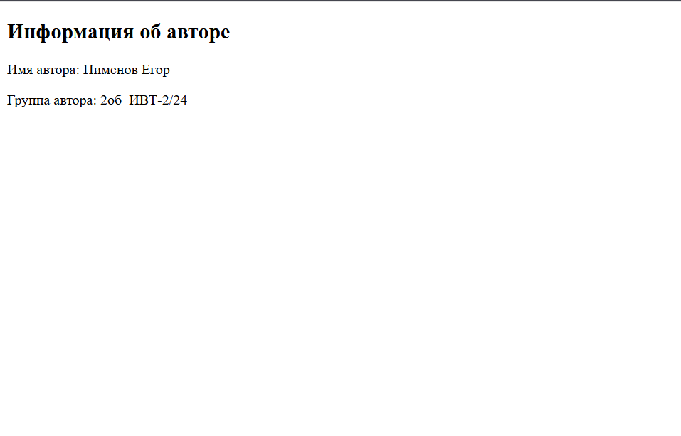
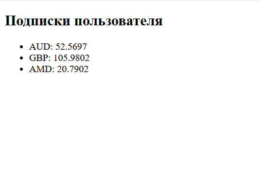

# Лабораторная работа №7

### Цель работы

1.  Создать простое клиент-серверное приложение на Python без серверных фреймворков.
    
2.  Освоить работу с HTTPServer и маршрутизацию запросов.
    
3.  Применять шаблонизатор Jinja2 для отображения данных.
    
4.  Реализовать модели предметной области (`User`,  `Currency`,  `UserCurrency`,  `App`,  `Author`) с геттерами и сеттерами.
    
5.  Структурировать код в соответствии с архитектурой MVC.
    
6.  Получать данные о курсах валют через функцию  `get_currencies`  и отображать их пользователям.
    
7.  Реализовать функциональность подписки пользователей на валюты и отображение динамики их изменения.
    
8.  Научиться создавать тесты для моделей и серверной логики.
___
### Модели

1.  **Author**
    
    -   `name`  — имя автора
        
    -   `group`  — учебная группа
        
2.  **App**
    
    -   `name`  — название приложения
        
    -   `version`  — версия приложения
        
    -   `author`  — объект Author
        
3.  **User**
    
    -   `id`  — уникальный идентификатор
        
    -   `name`  — имя пользователя
        
4.  **Currency**
    
    -   `id`  — уникальный идентификатор
        
    -   `num_code`  — цифровой код
        
    -   `char_code`  — символьный код
        
    -   `name`  — название валюты
        
    -   `value`  — курс
        
    -   `nominal`  — номинал (за сколько единиц валюты указан курс)
        
 5.  **UserCurrency**
        
        -   `id`  — уникальный идентификатор
            
        -   `user_id`  — внешний ключ к User
            
        -   `currency_id`  — внешний ключ к Currency
            
        -   Реализует связь «много ко многим» между пользователями и валютами.
    
 ___
### Структура проекта

```
myapp/  
├── models/  
│ ├── __init__.py  
│ ├── author.py  
│ ├── app.py  
│ ├── user.py  
│ ├── currency.py  
│ └── user_currency.py  
├── templates/  
│ ├── author.html  
│ ├── user_id.html  
│ ├── index.html  
│ ├── users.html  
│ └── currencies.html  
├── static/  
│ └── css, js, изображения  
├── myapp.py  
├── test_currencies.py  
├── test_models.py  
├── myapp.py  
└── utils/  
 └── currencies_api.py # Функция get_currencies
```
___

### Реализация моделей

Модели реализованы с помощью классов. Класс состоит из следующих элементов:
- Конструктор
- Геттеры
- Сеттеры

Сеттеры и геттеры реализованы при помощи декоратора `@property`
 Пример реализации модели Author:
 ```python
 from .author import Author


class App():

	def __init__(self, name, version, author):
		self.__name = name
		self.__version = version
		self.__author = author

	@property
	def name(self):
		return self.__name

	@name.setter
	def name(self, name):
		if isinstance(name, str) and len(name) > 2:
			self.__name = name
		else:
			raise ValueError("Ошибка при задании навзания приложения")

	@property
	def version(self):
		return self.__version
	
	@version.setter
	def version(self, version):
		if isinstance(version, str) and len(version) > 3:
			self.__version = version
		else:
			raise ValueError("Ошибка при задании версии приложения")

	@property
	def author(self):
		return self.__author

	@author.setter
	def author(self, author):
		if isinstance(author, Author):
			self.__author = author
		else:
			raise ValueError("Ошибка при задании автора приложения")
 ```
### Реализация маршрутов и обработки запросов

Запросы обрабатываются с использованием модуля `http.server`. Каждый из маршрутов обрабатывается с использованием словарей для компактности, а также с использованием `urllib.parse.parse_qs`
```python
templates = {
	"/": index_content,
	"/users": users_content,
	"/currencies": currencies_content,
	"/author": author_content,
	}


class CustomHandler(http.server.BaseHTTPRequestHandler):
	def do_GET(self):
		self.send_response(200)
		self.send_header("Content-type", "text/html")
		self.end_headers()

		if "?id=" in self.path:
			parsed_data = urllib.parse.parse_qs(self.path, separator="?")
			user_id = int(parsed_data["id"][0])
			uc_ids = [user.currency_id for user in uc_list if user.user_id == user_id]
			uc_currencies = [c for c in currencies_list if c.id in uc_ids]

			user_id_content = template_user_id.render(
				id=user_id,
				currencies=uc_currencies,
				navigation=[{"caption": "", "href": f"/user?id={parsed_data["id"]}"}]
			)

			self.wfile.write(bytes(user_id_content.encode("utf-8")))

		elif self.path in templates:
			self.wfile.write(bytes(templates[self.path].encode("utf-8")))


PORT = 8000
with http.server.HTTPServer(("", PORT), CustomHandler) as httpd:
	print(f"Сервер запущен!")

	httpd.serve_forever()
```
### Реализация шаблонов
Для работы с шаблонами создаем объект класс `Environment` и с его помощью получаем доступ к `html` шаблонам
```python
env = Environment( loader=PackageLoader("myapp"), autoescape=select_autoescape())

template_index = env.get_template("index.html")
template_users = env.get_template("users.html")
template_currencies = env.get_template("currencies.html")
template_author = env.get_template("author.html")
template_user_id = env.get_template("user_id.html")
```
Отрендерим полученные шаблоны, добавив необходимые переменные:
```python
index_content = template_index.render(
	navigation=[{"caption": "", "href": "/"}]
	)

users_content = template_users.render(
	users=users_list,
	navigation=[{"caption": "", "href": "/users"}]
	)

currencies_content = template_currencies.render(
	currencies=currencies_list,
	navigation=[{"caption": "", "href": "/currencies"}]
	)

author_content = template_author.render(
	author_name=main_author.name,
	author_group=main_author.group,
	navigation=[{"caption": "", "href": "/author"}]
	)
```
Теперь можно использовать переданные в `render` переменные в `html`-шаблонах
На примере `user_id.html`:
```html
<!DOCTYPE html>
<html>
<head>
	<meta charset="utf-8">
	<meta name="viewport" content="width=device-width, initial-scale=1">
	<title>ЛР №7</title>
</head>
<body>
	<h2>Подписки пользователя</h2>
	<ul>
	
		<li>{{ currency.char_code }}: {{ currency.value }}</li>
	
	</ul>
</body>
</html>
```
### Интегрирование функции get_currencies
Функция `get_currencies` была доработана, чтобы через нее можно было получить не только значение валюты `Value`, но и `ID`
```python
def get_currencies(currency_codes:list, url:str="https://www.cbr-xml-daily.ru/daily_json.js") -> dict:
	"""
	Получает курс валют API Центробанка России

	Args:
		currency_codes (list): Список символьных кодов валют (Например, ["USD", "EUR"])

	Returns:
		dict: Словарь вида {символьный код валюты: курс валюты, }
			В случае ошибки запроса возвращает None
	"""
	response = requests.get(url)
	response.raise_for_status()

	data = response.json()
	currencies = dict()

	if "Valute" in data:
		for code in currency_codes:
			if code in data["Valute"]:
				currencies[code] = {"Value": data["Valute"][code]["Value"], "ID": data["Valute"][code]["ID"]}
			else:
				currencies[code] = f"Код валюты '{code}' не найден."

	return get_currencies
```
Для интеграции функции будут использоваться списки для распределения валют по заготовленным пользователям
```python
users_list = list()
currencies_list = list()
uc_list = list()

for i in range(1, 4):
	user = User(id=i, name=f"User №{i}")
	users_list.append(user)

currency_list = ["AUD", "AZN", "DZD", "GBP", "EUR", "USD", "AMD", "BHD", "BRL"]
data = get_currencies(currency_list)

for code, values in data.items():
	c = Currency(id=values["ID"], num_code=None, char_code=code, name=None, value=values["Value"], nominal=None)
	currencies_list.append(c)

for i in range(len(currencies_list)):
	uc = UserCurrency(id=i + 1, user_id=users_list[i % 3].id, currency_id=currencies_list[i].id)
	uc_list.append(uc)

```
___
### Пример работы приложения
**/:**

**/users:**

**/currencies:**

**/author:**

**/user?id=1:**

___
### Тестирование
Для тестирования был использован фреймворк `pytest`. Для тестирования геттеров, сеттеров, исключений и функций также была использована параметризация

**Тестирование моделей:**
```python
from models import *
import pytest


"""Тестирование геттеров"""
@pytest.mark.parametrize("name, version, author",
	[("test_name", "test_version", Author("test_name", "test_group"))])
def test_app_getter(name, version, author):

	test_app = App(name=name, version=version, author=author)

	assert test_app.name == name
	assert test_app.version == version
	assert test_app.author == author


@pytest.mark.parametrize("name, group", [("test_name", "test_group")])
def test_author_getter(name, group):

	test_author = Author(name=name, group=group)

	assert test_author.name == name
	assert test_author.group == group


@pytest.mark.parametrize("id, num_code, char_code, name, value, nominal",
	[("test_id", "test_num_code", "test_char_code", "test_name", 0.12345, 100)])
def test_currency_getter(id, num_code, char_code, name, value, nominal):

	test_currency = Currency(id=id, num_code=num_code, char_code=char_code, name=name,
		value=value, nominal=nominal)

	assert test_currency.id == id
	assert test_currency.num_code == num_code
	assert test_currency.char_code == char_code
	assert test_currency.name == name
	assert test_currency.value == value
	assert test_currency.nominal == nominal


@pytest.mark.parametrize("id, name", [("test_id", "test_name")])
def test_user_getter(id, name):

	test_user = User(id=id, name=name)

	assert test_user.id == id
	assert test_user.name == name


@pytest.mark.parametrize("id, user_id, currency_id",
	[("test_id", "test_user_id", "test_currency_id")])
def test_user_currency_getter(id, user_id, currency_id):

	test_user_currency = UserCurrency(id=id, user_id=user_id, currency_id=currency_id)

	assert test_user_currency.id == id
	assert test_user_currency.user_id == user_id
	assert test_user_currency.currency_id == currency_id


"""Тестирование сеттеров"""
@pytest.mark.parametrize("name, version, author",
	[("test_name", "test_version", Author("test_name", "test_group"))])
def test_app_setter(name, version, author):

	test_app = App(name=None, version=None, author=None)

	test_app.name = name
	test_app.version = version
	test_app.author = author

	assert test_app.name == name
	assert test_app.version == version
	assert test_app.author == author


@pytest.mark.parametrize("name, group", [("test_name", "test_group")])
def test_author_setter(name, group):

	test_author = Author(name=None, group=None)

	test_author.name = name
	test_author.group = group

	assert test_author.name == name
	assert test_author.group == group


@pytest.mark.parametrize("num_code, char_code, name, value, nominal",
	[("tnc", "tcc", "test_name", 0.12345, 100)])
def test_currency_setter(num_code, char_code, name, value, nominal):

	test_currency = Currency(id=None, num_code=None, char_code=None, name=None,
		value=None, nominal=None)

	test_currency.num_code = num_code
	test_currency.char_code = char_code
	test_currency.name = name
	test_currency.value = value
	test_currency.nominal = nominal

	assert test_currency.num_code == num_code
	assert test_currency.char_code == char_code
	assert test_currency.name == name
	assert test_currency.value == value
	assert test_currency.nominal == nominal


@pytest.mark.parametrize("name", [("test_name")])
def test_user_setter(name):

	test_user = User(id=None, name=None)

	test_user.name = name

	assert test_user.name == name


"""Тестирование исключений"""
@pytest.mark.parametrize("name, version, author", [
	("tn", "test_version", Author("test_name", "test_group")),
	("test_name", "tv", Author("test_name", "test_group")),
	("test_name", "test_version", 115)
	])
def test_app_exep(name, version, author):
	with pytest.raises(ValueError):
		test_app = App(name=None, version=None, author=None)	

		test_app.name = name
		test_app.version = version
		test_app.author = author


@pytest.mark.parametrize("name, group", [
	("tn", "test_group"),
	("test_name", "tg")
	])
def test_author_exep(name, group):
	with pytest.raises(ValueError):
		test_author = Author(name=None, group=None)

		test_author.name = name
		test_author.group = group


@pytest.mark.parametrize("num_code, char_code, name, value, nominal", [
	("test", "tcc", "test_name", 0.12345, 100),
	("tnc", "test", "test_name", 0.12345, 100),
	("tnc", "tcc", None, 0.12345, 100),
	("tnc", "tcc", "test_name", "test", 100),
	("tnc", "tcc", "test_name", 0.12345, 0.12345)
	])
def test_currency_exep(num_code, char_code, name, value, nominal):
	with pytest.raises(ValueError):
		test_currency = Currency(id=None, num_code=None, char_code=None, name=None,
			value=None, nominal=None)

		test_currency.num_code = num_code
		test_currency.char_code = char_code
		test_currency.name = name
		test_currency.value = value
		test_currency.nominal = nominal


@pytest.mark.parametrize("name", [("tn")])
def test_user_exep(name):
	with pytest.raises(ValueError):
		test_user = User(id=None, name=None)

		test_user.name = name
```
**Тестирование `get_currencies`:**
```python
from utils.currencies_api import get_currencies
import pytest
import requests


@pytest.mark.parametrize("codes", [(["USD"]), (["BRL", "USD", "VND", "EUR"])])
def test_currency_eur(codes):

	currency_data = get_currencies(codes)

	for code in currency_data.keys():
		assert code in currency_data
		assert isinstance(currency_data[code]["Value"], float)
		assert currency_data[code]["Value"] > 0


def test_nonexist_code():
	assert "не найден" in get_currencies(["ABC"])["ABC"]


def test_error():
	with pytest.raises(requests.exceptions.RequestException):
		currency_data = get_currencies(None, url="https://jjfjj.js")
```
Все тесты можно запустить с помощью команды `python -m pytest`

**Результат тестов:**
```
collected 24 items                                                                                                                                      
                                                                                                                                                        
test_currencies_api.py ....                                                                                                                      [ 16%] 
test_models.py ....................                                                                                                              [100%] 
                                                                                                                                                        
================================================================= 24 passed in 2.14s ================================================================== 
```
___
### Выводы
В ходе выполненной работы было создано простое клиент-серверное приложение на Python с использованием `http.server` и шаблонизатора `jinja2`. Также были написаны тесты с использованием фреймворка `pytest`

Код был структурирован в соответствии архитектурой `MVC`

В ходе работы возникли трудности при написании тестов, однако чтение документации упростило работу